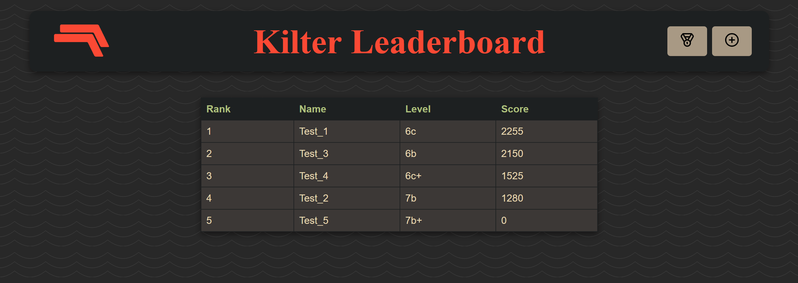
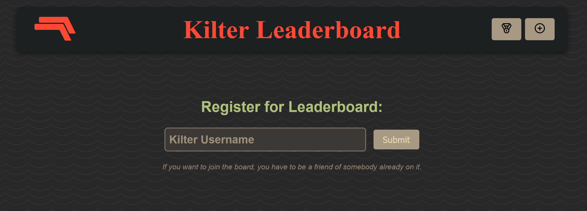

# KlieterBoard
A leaderboard for the Kilter bouldering board.

## Description

Users are ranked according to their performance, but the scoring is adapted to the strength of the user.  
In order to be on the leaderboard, you must have a public Kilter account and be friends with a person on the leaderboard.
## Visuals

### Leaderboard
The grade indicates the average of the user's five most difficult boulders. The score calculation is based on that value. It is calculated using only the boulders climbed in the current year.

### Registration Page

## Built with
* [![Spring][Spring.io]][Spring-url]
* [![Svelte][Svelte.dev]][Svelte-url]

## Contributors

[@oelyaz](https://github.com/oelyaz) mainly frontend  
[@zebraschmetterling](https://github.com/zebraschmetterling) mainly backend 

## License
Distributed under the [Unlicense License](https://unlicense.org).

<!-- LINKS & IMAGES -->
[Spring.io]: https://img.shields.io/badge/SpringBoot-6DB33F?style=for-the-badge&logo=Spring&logoColor=white
[Spring-url]: https://spring.io/
[Svelte.dev]: https://img.shields.io/badge/Svelte-4A4A55?style=for-the-badge&logo=svelte&logoColor=FF3E00
[Svelte-url]: https://svelte.dev/

